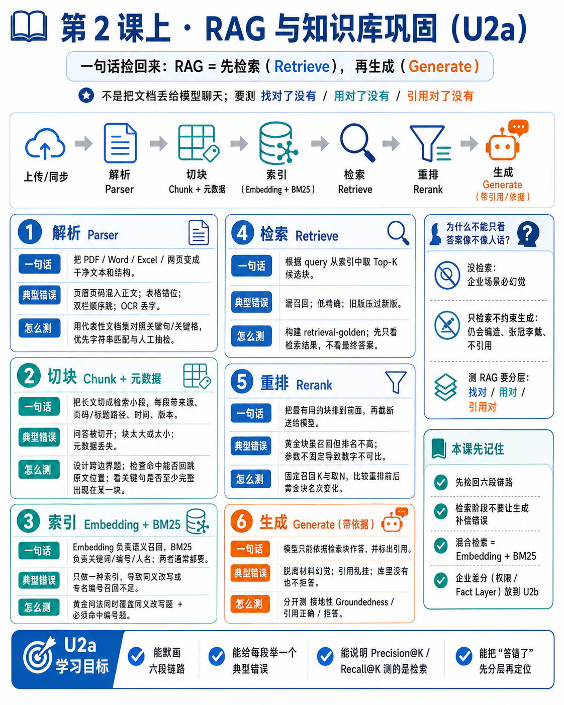
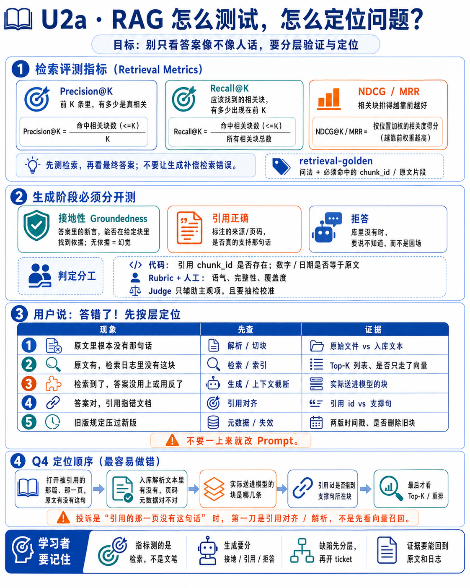
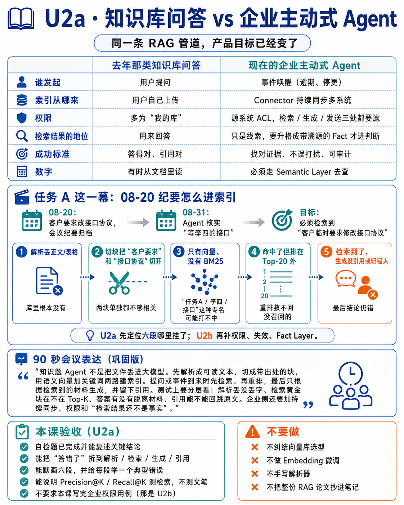

# 第 2 课上 · RAG 与知识库巩固（U2a）

> 日期：2026-09-01  
> 状态：**已收口**（2026-09-01：5 题作答 + 诊断 + 补答完成；「默画六段」「讲清 P@K/R@K」两项随用随补，见文末验收）  
> 为什么单独一截：知识库评测是去年的工作，今年 4 月后没再练，细节会生。先把链路捡回来，再学企业差分（U2b）。  
> 配套画布：[U2a RAG 六段](/Users/linhe/.cursor/projects/Users-linhe-Desktop-Workspace-05-Knowledge-Agent-Enterprise-agent/canvases/rag-refresh-u2a.canvas.tsx)

---

## 1. 一句话捡回来

RAG 不是「把文档丢给模型聊天」，而是两段式：

**先把可能相关的材料找出来（Retrieve），再让模型只根据这些材料说话（Generate）。**

- 没有检索：模型靠参数里的记忆，企业场景必幻觉。
- 只有检索、没有约束生成：模型仍可能编造、张冠李戴、不引用。
- 测 RAG 不是只测「答得像不像人话」，而是测 **找对了没有、用对了没有、引用对了没有**。

和主动式 Agent 的关系：任务 A 里 08-20 那份纪要，走的就是这条 L2a 路径。Agent 后面要「核实李四接口」，靠的不是聊天记忆，是当时有没有把纪要解析、切块、带元数据编进索引。

---

## 2. 六段链路（测试对象模型）



```
上传/同步 → 解析 Parser → 切块 Chunk + 元数据
    → 索引（向量 Embedding + 关键词 BM25）
    → 检索 Retrieve（常做混合）→ 重排 Rerank
    → 生成 Generate（带引用 / 依据）
```

个人知识库产品（去年那类：上传 PDF/Word → 问答、导读、引用）和企业主动式 Agent **共用这六段**。差别不在公式，在索引从哪来、权限怎么滤、检索结果算不算事实——那是 U2b。

### 2.1 解析 Parser

- **一句话**：把 PDF / Word / Excel / 网页变成干净文本和结构（标题、表格、阅读顺序）。
- **输入 → 输出**：文件字节 → 文本 + 粗结构。垃圾进，后面全错。
- **你以前多半测过**：扫描件乱码、双栏论文顺序跳、表格抽成一锅粥、图片里的字丢了。
- **典型错误**：页码/页眉混进正文；表格行错位；目录和正文重复切。
- **怎么测**：准备公司代表性文档集（合同、纪要、带表 PDF）。对照「关键句/关键格是否还在、顺序是否对」。能字符串匹配的不要用模型打分。
- **判定**：代码 / 人工抽检。不要用 LLM-as-Judge 判「这一格数字在不在」。

### 2.2 切块 Chunking + 元数据 Metadata

- **一句话**：长文切成检索用的小段；每段必须带着来源、页码/标题路径、时间、版本。
- **输入 → 输出**：干净长文 → `chunk{text, doc_id, loc, time, version, …}`。
- **典型错误**：
  - 问和答、表头和数字被切开，检索只拿到一半。
  - 块太大：检索不准，还浪费上下文窗口。
  - 块太小：没有周围句子，生成只能猜。
  - **元数据丢了**：答对了也不知道是哪年哪版。
- **怎么测**：构造「必须跨过切块边界才能答对」的题（表头在上一块）；检查每条命中能否回跳原文位置。
- **重叠（overlap）**：相邻块重复一小段，就是为了少切断。测的是「关键句是否至少完整出现在某一块」，不是重叠百分比本身。

### 2.3 索引：Embedding + BM25

- **Embedding**：把一段话变成向量，语义近的距离近。「接口协议变更」和「客户改了 API 约定」可能对上。
- **BM25**：关键词。任务编号、人名、工单号、缩写，向量经常打不过它。
- **两者都要**：这叫混合检索的索引侧准备。不是二选一。
- **不要在这课学**：HNSW、模型怎么训练、选哪家向量库。测试只需知道「语义召回」和「精确词召回」会漏不同的东西。
- **怎么测**：黄金问法里同时放「同义改写题」和「必须命中编号的题」。只测一种，另一半缺陷看不见。

### 2.4 检索 Retrieve

- **一句话**：用问题去两路索引里取 Top-K 块。
- **输入 → 输出**：query → 候选块列表（带分数）。
- **典型错误**：相关块在库里但没进 Top-K（漏召回）；进了 Top-K 但全是近义废话（低精确）；旧版本文档压过新版。
- **指标（先记住三个）**：
  - **Precision@K**：前 K 条里有多少是真相关。
  - **Recall@K**：该找到的相关块，有多少出现在前 K。
  - **NDCG / MRR**：相关块排得越靠前越好。
- **怎么测**：`retrieval-golden`：问法 + 必须命中的 chunk_id / 原文片段。检索阶段 **先不要看最终答案**，否则生成补偿了检索错误，缺陷会被藏住。

### 2.5 重排 Rerank

- **一句话**：第一轮召回求「别漏」，重排求「把最有用的挪到最前」，再截断送给模型。
- **测什么**：重排后，黄金块的名次有没有上升；送给模型的 N 段里黄金块在不在。不测「模型是否更会说话」。
- **常见坑**：重排模型也有延迟和费用；测试要固定「召回 K / 重排后取 N」，否则每次数字不可比。

### 2.6 生成 Generate（带依据）

- **一句话**：模型只能依据检索到的块作答，并标出引用。
- **三件必须分开测**：
  1. **接地（Groundedness）**：答案里的断言，能否在给定块里找到依据。无依据 = 幻觉。
  2. **引用正确**：标注的来源/页码确实支持那句话，不是随便挂一个文档名。
  3. **拒答**：库里没有时要说不知道，而不是圆场。
- **判定分工**：
  - 引用指向的 chunk_id / 原文是否存在：代码。
  - 答案数字、日期是否等于原文：代码。
  - 语气、是否完整覆盖问题：Rubric + 人工；Judge 只能打这类，且要抽检校准。

去年知识库产品里「问答依据、引用准确性、导读完整性」对应的就是 2.6，不是模型文采。

---

## 3. 缺陷先分层，再开 ticket



上线后用户说「答错了」，不要先改 Prompt。按层问：

| 现象 | 先查 | 证据 |
| --- | --- | --- |
| 原文里根本没有那句话 | 解析 / 切块 | 原始文件 vs 入库文本 |
| 原文有，检索日志里没有这块 | 检索 / 索引 | Top-K 列表、是否只走了向量 |
| 检索到了，答案没用上或用反了 | 生成 / 上下文截断 | 实际送进模型的块 |
| 答案对，引用指错文档 | 引用对齐 | 引用 id vs 支撑句 |
| 旧版规定压过新版 | 元数据 / 失效 | 两版时间戳、是否删除旧块 |

这和主动式 Agent 第 1 课 Q4 的「按层定位」是同一肌肉，只是对象从催办消息换成了问答。

---

## 4. 个人知识库 vs 企业 Agent（先记差别，细节 U2b）



| | 去年那类知识库问答 | 现在的企业主动式 Agent |
| --- | --- | --- |
| 谁发起 | 用户提问 | 事件唤醒（逾期、停更） |
| 索引从哪来 | 用户自己上传 | Connector 持续同步多系统 |
| 权限 | 多为「我的库」 | 源系统 ACL，检索/生成/发送三处都要滤 |
| 检索结果的地位 | 用来回答 | 只是线索，要升格成带溯源的 Fact 才进判断 |
| 数字 | 有时从文档里「读」 | 必须走 Semantic Layer 去查（第 3 课） |
| 成功标准 | 答得对、引用对 | 找对证据、不误打扰、可审计 |

同一条解析→检索管道，产品目标已经变了。巩固课把管道捡回来；U2b 专门练右边多出来的那些。

---

## 5. 任务 A 这一幕：08-20 纪要怎么进索引

场景：08-20 客户要求改接口协议，会议纪要归档。08-31 Agent 核实「等李四的接口」时，必须能检索到「客户临时要求修改接口协议」。

这一幕在巩固课只要求你能指出 **六段里哪段挂了会找不到这句话**：

1. 解析把纪要表格/纪要正文弄丢 → 库里根本没有。
2. 切块把「客户要求」和「接口协议」切开，两块单独都不够相关。
3. 只有向量、没有 BM25，问「任务A / 李四 / 接口」这种带专名的可能打不中。
4. 命中了但排在 Top-20 之外，重排也救不回没召回的。
5. 检索到了，生成时没引用、或当成张三的锅。

U2b 再补：谁有权检索这份纪要、旧版纪要是否失效、检索句如何变成 fact 而不是直接当真相。

---

## 6. 90 秒会议表达（巩固版，可先用）

> 「知识进 Agent 不是把文件丢进大模型。先解析成可读文本，切成带出处的块，用语义向量加关键词两路建索引。提问或事件到来时先检索、再重排，最后只根据检索到的材料生成，并留下引用。测试上我们分层看：解析丢没丢字、检索黄金块在不在 Top-K、答案有没有脱离材料、引用能不能回跳原文。个人知识库和企业 Agent 共用这条管道；企业侧还要加上持续同步、权限和『检索结果还不是事实』，那是下一截。」

---

## 7. 自检题（先闭卷写，再对照笔记）

**Q1 · 分工**：有人说「上下文窗口越来越大，RAG 可以淘汰，整份知识库塞进 Prompt 就行」。你怎么反驳？（提示：更新、权限、费用、干扰、审计。）

**Q2 · 双索引**：用户问「任务 A 的接口协议改了什么」。如果系统只做向量检索、不做 BM25，最可能漏掉什么？为什么？

**Q3 · 切块**：一份纪要表格：表头是「依赖方 / 交付物 / 日期」，下一页才是「李四 / 接口 / 08-28」。只切页、不重叠。问答「李四要交付什么、哪天」时，典型会出什么错？

**Q4 · 分层定位**：用户投诉「答案里引用了《需求变更纪要》，但打开那一页没有这句话」。写出你检查的顺序，以及每一层看什么日志/文件。

**Q5 · 产品边界**：用三句话说明：知识库问答测「答得好不好」，为什么不够测主动式 Agent 的 L2a？还缺哪两件（提示：谁触发检索；检索结果接下来去哪一层）？

### 我的作答

（2026-09-01 闭卷）

**Q1**：觉得「窗口变大就能淘汰 RAG」有些武断。部门/公司资料会慢慢自增；不用 RAG 如何保证各部门资料不混淆、能正确读取；就算读对了，效率和费用如何保证；机密文件是否也要塞进上下文；财务、法律、产品资料会不会泄密。

**Q2**：不清楚 BM25 是什么，本题无法作答。

**Q3**：会出现「依赖方 / 交付物 / 日期」与「李四 / 接口 / 08-28」不相关，导致数据混乱。

**Q4**：看向量召回是否生效，ranked 是否正确。

**Q5**：答得好不好，不是从知识库找对应信息，而是根据检索到的信息去判断是否完成，不完成再去检索其它信息，是一个模型预测的过程。

### 导师诊断

（2026-09-01）

总体：Q1 可用，权限/费用/混淆已经在用测试语言说话。缺口集中在两处——**BM25 / 双索引还不在工作记忆里**，以及 **「答错了」会直接跳到检索，跳过解析和引用对齐**。U2b 先不开；补完 Q2 一句 + 读懂 Q4 顺序再进入企业差分。

| 题 | 判定 | 评语 |
| --- | --- | --- |
| Q1 | 过 | 规模自增、部门混淆、费用、机密/泄密都点到了，对应提示里的干扰、费用、权限。可再补两刀：资料一更新，整库塞 Prompt 就要整包重送，RAG 可以增量编索引（更新）；出了问题要能指出「用过哪几块」，整库进上下文难以审计（审计）。 |
| Q2 | 未答 | 术语缺口，不是推理失败。见下方补讲后重答一句。 |
| Q3 | 半对 | 「表头和数据分家」方向对。「数据混乱」太宽。更准的失败是：检索常只拿到「李四 / 接口 / 08-28」半截，模型不知道哪一列是交付物、哪一列是日期，于是答错或自己补列名（幻觉）。 |
| Q4 | 偏了 | 投诉是「引用的那一页没有这句话」，第一刀应是引用对齐 / 解析，不是向量召回。顺序：① 打开原文件该页，原文有没有这句；② 入库解析文本里有没有、页码元数据对不对；③ 实际送进模型的块是哪几条；④ 引用 id 是否指向支撑句所在块；⑤ 最后才看 Top-K / 重排。生成完全可能编造一句却挂上一个看起来合理的文档名。 |
| Q5 | 未中 | 你写的是「检索不够再检索」的 Agent 循环，和题目问的不是一件事。知识库问答：人问 → 检索 → 回答，成功标准是答对、引用对。主动式 Agent 的 L2a 还缺两件：① 检索往往由事件/调查触发，不是等人打字；② 检索块接着进 Fact Layer，不是直接当答案。只测「答得好不好」测不到「该查的时候查到了没有」和「有没有把检索句误升成事实」。 |

**补讲 · BM25（给 Q2 用）**  
BM25 是关键词检索：问句里出现的字/编号，在块里也要出现，才容易排前面。向量检索是语义近： 「改了接口协议」和「客户临时要求修改 API 约定」可能对上，但短编号「任务 A」、人名「李四」语义很瘦，向量经常打不中那一行。所以只做向量时，最可能漏掉的是**带专名/编号的那一块**（任务 A 的纪要行），却召回一堆泛泛的「接口变更」文档。企业检索的事实标准是两路一起做，叫混合检索。

**补答（2026-09-01）**

**Q2**：不做 BM25，最可能漏掉带任务编号或人名的纪要信息。→ 过。

**Q4**（来信标成 Q3，内容是定位顺序）：先看提问对应文档里有没有出处 → 入库文本有没有 → 送进模型的是哪些块 → 引用是否支撑回答 → 最后看 Top-K。→ 过。收紧两处：第一刀是**被引用的那篇、那一页**，不是「和问题相关的任意文档」；第四刀是引用 id 是否指到支撑句所在块，不是泛问「能不能回答」。

**U2a 收口**：通过。下一课 U2b。

---

## 8. 本课验收（U2a）

- [x] 自检 5 题有书面答案（Q1 过；Q2 补答过；Q3 半对已讲清；Q4 补答过；Q5 已讲清，不挡 U2b）
- [x] 能把「答错了」拆到解析 / 检索 / 生成 / 引用（Q4 补答后顺序对）
- [ ] 能默画六段，并给每段举一个典型错误（随用随补，不挡 U2b）
- [ ] 能说明 Precision@K / Recall@K 测检索、不测文笔（随用随补）
- [x] 不要求本课写完企业权限用例（那是 U2b）

**不要做**：向量库选型、Embedding 微调、手写解析器、把整份 RAG 论文抄进笔记。
