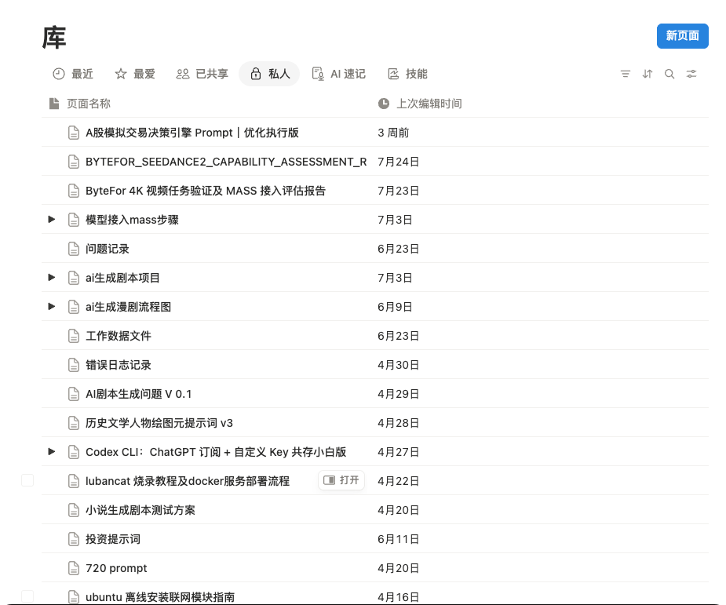
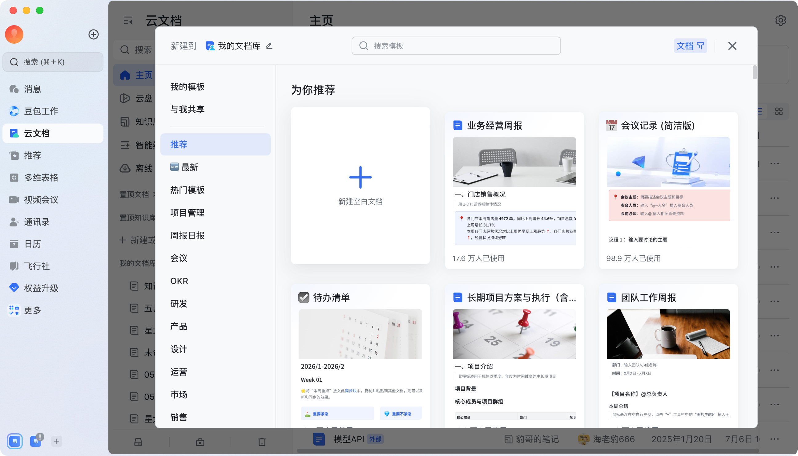
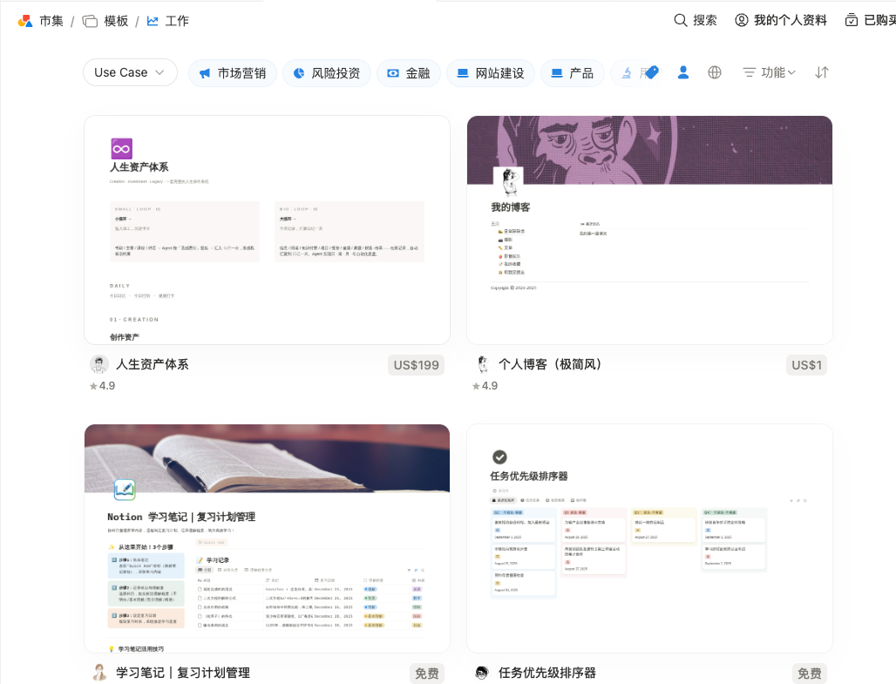
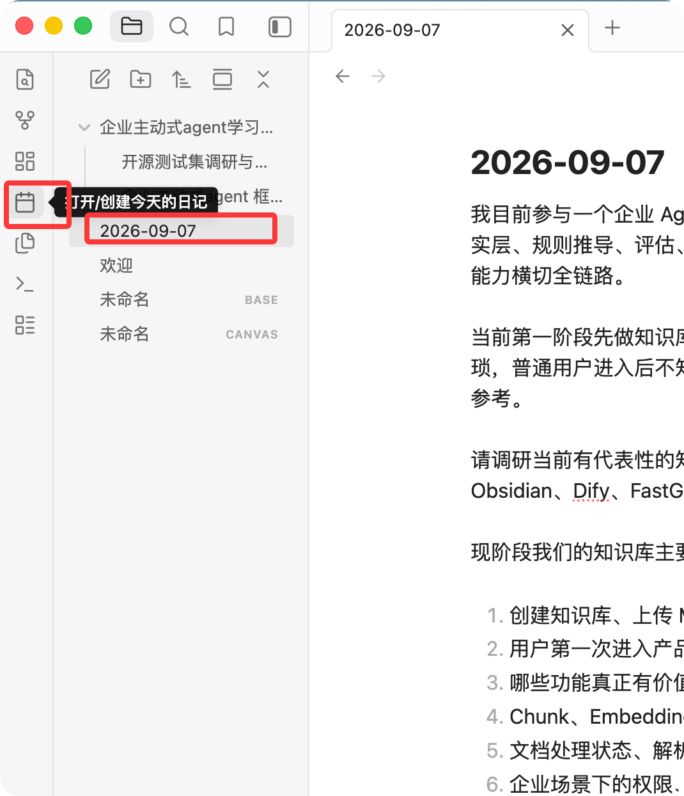

# 企业知识库竞品调研与 Markdown 文档管理一期建议

报告日期：2026 年 9 月 9 日  
官方资料查阅日期：2026 年 9 月 7 日  
产品定位：企业 Agent 项目一期的文档管理模块。主线是把已有文档上传进来、转换成 Markdown，转换结果可以在线修改和维护；直接在库里新建 Markdown 是次要入口。

本报告重点看 Notion、Obsidian、飞书知识库、语雀、有道云笔记，另外参考 GitBook 的目录与版本设计。一期要解决的是把文档收进来、转换好、组织好，之后好找、好改、好管。

## 摘要

一期做的是一个把已有资料收进来、转成 Markdown、能查能改能管的文档库。Agent 接入和 RAG 问答是下一阶段的事，这一点已经和领导确认过。所以本报告只看文档和笔记类产品，没有纳入 Dify、FastGPT、MaxKB、RAGFlow 这些“上传后切片给模型”的 RAG 平台；Chunk、Embedding、TopK、召回测试、引用溯源这些概念也不进入一期页面和验收。等 Agent 接入排期定了，再对 RAG 平台补一轮调研。

主线是“上传 → 转换成 MD → 检查 → 维护”。转换出来的 MD 是正文，原文件留作来源副本，两者的关系要一直看得见。直接在库里新建文档是次要入口，一期做到能新建、能保存就够，模板和写作辅助往后放。

六个产品都说自己“支持 Markdown”，但含义完全不同：有的只是快捷输入，有的是导入后转成自己的页面，有的能导出，只有 Obsidian 是原生存 MD（见 2.2）。这也是我们最容易在用户那里出问题的地方：上传完拿到的到底是什么，必须说清楚。具体值得学的是飞书和语雀的目录与批量整理、Obsidian 的“同一份文档读写切换”、有道的保存反馈和当前文件夹搜索。分类和标签不要强制，先把目录、搜索、最近访问做可靠。

一期 P0（详见第 7 节）：创建知识库；上传与转换；转换核对；转换结果可修改并可靠保存；基础目录与浏览；标题和正文搜索；版本与来源；删除与回收站；权限一致控制；单篇 MD 导出。新建空白文档、模板、置顶与批量整理是 P1。

提测前要定下来的事：上传源格式范围（本报告按 `.md`、`.docx`、`.txt` 写）；首批资料量；会不会多人同时改同一篇；库级权限够不够；有没有必须沿用的审批流；Agent 大概什么时候接。前三条直接决定转换器范围和要不要做冲突保护。

## 1. 个人使用感受

飞书和 Notion 的模板功能是我比较满意的，Obsidian“打开/创建今天的日记”这个入口我也很喜欢。它们都给了一个比较明确的开始方式，不需要面对一张空白页面，再想接下来应该做什么。

但随着日常使用，我在这三个产品里积累的笔记会慢慢变得杂乱，没有形成自己统一的分类方式。

以我自己的 Notion 为例，模型接入、问题记录、项目资料、各种提示词放在同一个列表里，没有按项目或主题统一分类。**有事情要查询时，我通过搜索通常能很快找到；不满意的主要是打开列表时的观感，看起来没什么条理。**



*图 1：个人截图。展示的是我当前的笔记组织方式，不能据此判断 Notion 没有分类能力，也不能推导出它的搜索体验差。*

因此，我希望我们重点考虑三个问题：开始记录是不是方便，需要时能不能找到，平时打开知识库是否清楚、舒服。模板可以给起点，搜索可以帮助查找，目录和分组则可以改善浏览。它们解决的问题不完全相同。

我的倾向是：允许先记下来、先放进来，需要整理时再提供简单的移动和分组操作。不要为了让系统看起来“有结构”，要求每个人新建一篇文档前都填写项目、主题、标签等一堆信息。

以上是个人感受及由此提出的建议。转换准确性、保存可靠性、权限和历史恢复属于本项目需要验证的能力，不能写成我在这些产品中已经遇到的问题。

## 2. 调研目标与范围


### 2.1 一期的主线和次线

> **主线，导入已有资料：**进入知识库 → 上传文件 → 转换成 MD → 检查结果 → 之后在库里修改和维护。
>
> **次线，直接写新资料：**进入知识库 → 新建文档 → 写内容 → 保存 → 之后查找、修改和复用。

文档管理不是只存附件或只读展示，转换出来的 MD 要能改、能存住，否则用户发现一处错字也只能回去改 Word 重传。但编辑的范围一期不用做大：转换结果能修正、能新建一篇空白文档并保存就够，模板、工作日志入口、更完整的写作工具都往后放。

这次重点看：导入和新建是否容易理解；文档转换后是什么形态；目录、搜索和浏览如何配合；预览、编辑、保存、更新、删除是否符合预期；权限、来源、版本、导出是否足够清楚。

具体上传格式尚未最终确认。下文暂以 `.md`、`.docx`、`.txt` 作为建议基线，PDF、扫描件及其他格式单独讨论。这是范围建议，不代表团队已经承诺支持这些格式。

### 2.2 不要把几种“支持 Markdown”混为一谈


| 能力 | 实际含义 | 本项目需要确认的事 |
| --- | --- | --- |
| Markdown 快捷输入 | 输入符号后生成标题、列表等编辑器内容 | 不代表最终保存的是 MD 文件 |
| 导入 Markdown | 读取 `.md` 并放进产品 | 可能转换为产品自己的页面或文档模型 |
| 导出 Markdown | 把现有文档转换成 `.md` | 不代表所有组件、图片、评论和权限都能完整带走 |
| 原生 MD 文档管理 | 围绕 MD 正文读写、保存和维护 | 本项目应明确 MD、图片资源、版本之间的关系 |
| 上传原文件附件 | 文件被保存，可以预览或下载 | 不等于正文已转换成可编辑 MD |


Notion 官方将导入描述为转换成页面；飞书区分上传 Word 文件和导入云文档；有道确认“Word 转笔记”，但未在该说明中承诺转成 MD。它们能帮助我们研究交互，却不能直接证明我们的转换要求已经被完整覆盖。[N1]、[F1]、[Y1]

### 2.3 产品分类与证据口径


| 分类 | 产品 | 对本项目的参考重点 |
| --- | --- | --- |
| 团队 Wiki 与在线文档 | Notion、飞书、语雀 | 新建文档、模板、知识库目录、共享维护与权限 |
| Markdown 笔记与个人资料管理 | Obsidian、有道云笔记 | 直接写 MD、轻量记录、文件夹、预览和保存 |
| 文档目录与版本维护补充 | GitBook | 长文阅读、目录结构、变更与内容可携带性 |


本次结合个人使用反馈、四张截图和官方资料，没有登录六个产品统一执行导入实验。操作路径来自文档，阶段数是估算，处理耗时、点击数和成功率没有实测。关于“用户为什么愿意用”的分析是设计判断，不是满意度或留存数据。

资料不足的内容明确写为待验证，不能视为功能不存在。滚动帮助、旧版说明、个人笔记产品与团队协作产品也分别注明，避免拼出一个实际不存在的“全功能版本”。

## 3. 各产品核心流程与取舍


### 3.1 Notion：写文档容易开始，组织方式需要按任务收敛

Notion 的参考价值首先在创建体验：新建页面后可以直接写，也可以用模板给内容一个起点。编辑器以内容块组织正文，支持 Markdown 快捷输入，但这不等于直接编辑一个本地 MD 文件。[N2] 我对模板的正面感受、对列表观感的意见属于个人体验，见正文图 1 和附录图 3。

导入方面，官方支持 Word `.docx`、TXT 和 Markdown；可批量选择，ZIP 可保留目录结构，结果转成 Notion 页面。Word 的评论、修订和复杂布局并不完整导入，合并单元格也可能失真。Markdown 的锚点和非标准扩展有兼容限制。导入后应校对内容，而不是只看文件是否出现在列表里。[N1]

日常通过页面层级组织，编辑器阅读和修改正文，删除后可恢复，历史版本保留时长依套餐而定。Wiki 还提供负责人和验证机制，页面与空间有访问设置。[N3]、[N4]、[N5] 非数据库页面可导出 MD，数据库主要导出 CSV，部分特殊块会变成 HTML；导出不等于原样复建整个工作空间。[N6]

**从 Notion 拿过来的应该是现成的起点和顺手的正文编辑。** 对只想记录或维护资料的人，不必先介绍数据库、Wiki、Teamspace 等完整体系。我的列表没有统一分类，但搜索仍能满足查询，因此我们应验证轻量目录和浏览呈现，而不是假定每个人都需要复杂分类模型。

### 3.2 Obsidian：最直接的 Markdown 参考

Obsidian 创建或打开一个 Vault 后，就可以新建笔记；已有 MD 文件可拖进文件列表，或直接复制到本地目录。笔记主要使用本地 `.md`，文件夹即组织结构。官方 Importer 还提供迁移入口，但它需要单独安装，不能写成普通拖拽就能把任意 Word、PDF 都转换好。[O1]、[O2]、[O3]

阅读视图、Live Preview 和源码模式适合不同编辑习惯；文件可以重命名、移动、删除，Sync 服务另提供版本历史。搜索既能找正文，也能按路径等条件缩小范围。我们可以借鉴“同一份文档，读写方式可切换”，让用户始终知道改的是哪一篇。[O4]、[O5]、[O6]、[O7]

日记入口把新建、按日期命名和再次打开串成了一个动作，还可配合模板。[O8] 我喜欢的是入口直接、开始记录轻松。我们可以先做好“在当前位置新建文档”，是否增加工作日志快捷入口，等业务需求明确后再做。

Obsidian 的可携带性适合本项目，企业权限则不能直接照搬：官方共享 Vault 文档说明尚无细粒度权限，协作者基本拥有与所有者相同的权限，也不支持同文档实时协作编辑。[O9]

**学它的文件归属、读写切换和快捷记录；插件、图谱、双链、Canvas 不碰。** 那些对重度笔记用户有价值，但不会自动让所有人的资料列表变清楚。

### 3.3 飞书：适合研究团队文档，但要分清导入结果

飞书可以在知识库中建页面、添加已有云文档，按页面树组织；新建文档可从空白或模板开始。我的模板截图里能直接看到会议记录、周报、待办等工作场景，用户比较容易判断选哪一类。[F1]、[F2]

一个和本项目很像的问题是：“上传文件”和“导入文档”有何区别。官方说明，上传 Word 保留其文件形态，导入则生成新的云文档；上传 .docx、.xlsx、.pptx 等文件时会提示可以导入为云文档，用户自己选“仅上传”还是“导入”。[F1]、[F3]

Markdown 的路径官方帮助写得很具体（2026 年 5 月 8 日更新）：导入位置选“我的文档库或知识库”时，支持的类型是 .zip、.doc、.docx、.xls、.xlsx、.csv、.base、.pptx、.xmind、.mm、.opml，里面没有 .md；导入位置选“文件夹”时才支持 .md、.markdown、.mark、.txt 等。也就是说，一个 .md 要进知识库得绕一步：先导入到云盘文件夹转成云文档，再移进知识库。ZIP 里带 .md 能不能直接进知识库、图片能不能保住、同名怎么处理，帮助里没写，要实测。[F3] 这个例子说明，同一个“导入”按钮在不同位置支持的格式不同，用户是记不住的；我们只给一个入口、一张格式清单。

补查到的官方 2026 年 5 月说明已确认云文档可以通过“下载为 → Markdown”导出。图片和附件写入链接，评论不随正文导出；这不能解释成所有素材已经离线打包好。它也不能证明云文档内部原生保存为 MD。[F4]

组织方面，子页面列表支持列表或宫格呈现、排序和批量管理，而且只展示当前用户有权阅读的内容。知识库页面支持批量移动、删除，删除内容进入回收站；版本管理区分编辑与阅读权限，版本访问跟随源文档。[F5]、[F6]、[F7]

**飞书最该学的是按工作场景给的模板、清楚的目录入口和可选的浏览方式。** 对已有飞书用户，这些操作嵌在熟悉的工作环境里。要避开的是它“上传附件、导入云文档、知识库页面”三个概念并存的状况，我们只让用户看到一种结果：转换后的文档，原文件挂在旁边。

### 3.4 语雀：知识库目录与文档维护

语雀的官方帮助给出了较完整的迁入路径：工作台或知识库中选择“新建 → 导入”，选择目标库和文件格式，上传后查看结果。支持 Word、Markdown，以及包含 MD 与图片的 ZIP；状态区分等待、上传进度、处理、失败和成功。单篇文档支持导出 MD，但整库导出帮助主要说明 Lakebook/PDF，不能由此推断整库一键导出 MD。[Q1]

直接创作在知识库内新建文档，编辑器支持 Markdown 快捷输入，官网模板中心提供会议、周报、项目立项等起点。官方 Lakebook 格式说明中的正文包含 HTML/Lake，因此更准确的表述是“支持 MD 导入、快捷输入和导出”，不应称其所有文档都原生存为 MD。文档内插入 PDF/PPT 供预览，也不等于转换为 MD 正文。[Q2]、[Q3]、[Q7]、[Q8]

目录管理是本次最值得参考的部分：可拖动层级与顺序、增加分组，在目录内新建子页，可单篇重命名，并批量移动、复制或删除文档；还可设置目录默认展开层级。删除文档可在库的回收站找回。公开范围与协作者权限分别设置，协作者区分阅读、编辑、管理。[Q4]、[Q5]、[Q6]

对以项目、制度或手册组织内容的团队，这种“先有一本知识库，再围绕目录维护”的模型比较容易解释；大量临时笔记是否适合预先安排目录，仍要看记录习惯。**目录操作和分组照着做，同时保留在当前库直接写的入口。** 语雀帮助里说的是目录历史可恢复，正文版本是否都能恢复没有核实，不要混在一起写。

以上来自本次仍可访问的官方帮助，相关页面多标注 2022—2023 年更新。我们通过浏览器阅读帮助页，未登录实测产品；当前套餐、界面及正文历史恢复仍需验证。

### 3.5 有道云笔记：直接记录与文件夹管理，范围较贴近个人使用习惯

官方新建入口包含普通文档、Markdown 和脑图，也提供“Word 转笔记”。这里可以确认 Word 内容转成笔记，但不能写成自动转成 MD。普通笔记中的附件上传与正文转换也应分开。[Y1]、[Y2]

Markdown 帮助介绍分屏预览、语法工具栏和云端保存，并包含所见即所得、斜杠菜单等版本更新说明。不过页面混有 7.1.8 旧版内容，不能把其中截图当作本次验证过的当前界面。Mac 更新日志仍记录后续 MD 编辑增强。[Y3]、[Y4]

值得参考的近期组织能力包括文件夹置顶、目录展开收起、按创建或更新时间筛选，以及默认在当前文件夹搜索。它们分别帮助用户回到常用内容、缩小浏览和查找范围，不需要先建设复杂的分类体系。[Y4]

官方有历史版本、回收站和冲突笔记的说明。冲突可能需要人工比对处理，自动保存不能理解成自动解决多端覆盖；历史机制是否对各类 MD 笔记同等覆盖、导出资源是否完整仍待实测。个人分享说明也不足以证明完整企业角色、审计和来源 ACL 能力。[Y5]、[Y6]、[Y7]、[Y8]

**从有道拿来的是工具栏辅助写 MD、保存反馈和简单的文件夹操作。** 它让用户在新建时先分清普通笔记、MD 笔记、脑图，这一步我们不需要：我们的结果只有一种，可编辑的 MD，入口可以比通用笔记产品集中得多。

### 3.6 GitBook：补充参考目录阅读与版本，不作为一期建站目标

GitBook 可创建 Space，导入 Markdown/ZIP，再按页面层级编辑和维护；版本历史、回退和变更请求适合重要文档。现有资料经过整理后，目录和正文的关系清楚，适合操作手册等连续阅读任务。[G1]、[G2]、[G3]

编辑器使用结构化块，Git Sync 可以把内容维护到仓库中的 Markdown。官方也提醒特殊组件、嵌套块等不一定能完整迁移为标准 MD。普通编辑体验和内容导出能力必须分别看，不能将 Git 同步当成所有员工都会用的导出按钮。[G4]、[G5]

导入时默认开启的 AI 格式适配可以关闭。[G1] 对我们的企业资料，转换过程应优先保留原内容，不能把自动重写混进格式转换。**目录和版本可以学；发布站点、Git 工作流和复杂组件一期不需要。**

## 4. 横向对比


### 4.1 第一次怎样得到一篇可继续维护的文档

按已有账号、目标空间可访问计算关键阶段；不含登录、下载客户端、处理等待，也不是实测点击数。创建新库会增加一步。


| 产品 | 导入已有资料（我们的主线） | 直接创建 | 主要理解成本 |
| --- | --- | --- | --- |
| Notion | 选导入类型 → 上传 → 检查页面，约 3 阶段 | 新建页面 → 空白/模板写作，约 2 阶段 | 页面与数据库等概念；导入后是 Notion 页面 |
| Obsidian | MD 放进 Vault → 检查，约 2 阶段 | 打开 Vault → 新建笔记 → 写作，约 3 阶段 | Vault 与本地目录；其他格式迁移需另选方式 |
| 飞书 | Word 等：选导入云文档 → 上传 → 检查归属和内容，约 3 阶段；.md 要先导入到文件夹再移入知识库，约 4 阶段 | 进入库/目标页 → 新建空白/模板 → 写作，约 3 阶段 | 上传附件、导入云文档和 Wiki 归属容易混淆；不同位置支持的格式不同 |
| 语雀 | 选择导入及目标 → 上传并处理 → 检查，约 3 阶段 | 进入知识库 → 新建文档 → 写作，约 3 阶段 | 文档类型、目录与导入格式；当前入口按账号核实 |
| 有道云笔记 | Word 转笔记 → 选文件 → 查看内容，约 3 阶段 | 新建时选 Markdown → 写作，约 2 阶段 | 普通笔记、MD 笔记和附件结果不同 |
| GitBook | Space 导入 → 上传 → 检查整理，约 3 阶段 | 建/选 Space → 新建页面 → 写作，约 3 阶段 | 文档空间与后续发布/Git 体系，后两者不是写作必经步骤 |


创建与导入依据见 [N1]、[N2]、[O1]、[O2]、[F1]、[F2]、[F3]、[Q1]、[Q2]、[Y1]、[G1]。这里的终点是文档可以阅读和维护，不计算“上传后让 AI 使用”的阶段，那是下一阶段的事。

### 4.2 文档形态、日常维护和企业能力


| 产品 | MD 与转换的真实边界 | 组织与维护 | 权限、恢复及待验证点 |
| --- | --- | --- | --- |
| Notion | Word/MD 转页面；支持导出 MD，不是本地 MD 原样读写 | 页面层级、块编辑；个人反馈搜索好用、列表观感可改善 | 页面/空间权限，历史与恢复依套餐；导出不完整保留全部专有结构 [N1]、[N2]、[N3]、[N4]、[N5]、[N6] |
| Obsidian | 原生本地 MD；任意 Office/PDF 自动转换未核实 | 文件夹、搜索、预览/源码、模板与日记 | Sync 历史为单独服务；共享 Vault 无细粒度权限 [O1]、[O2]、[O3]、[O4]、[O5]、[O6]、[O7]、[O8]、[O9] |
| 飞书 | 上传原文件与导入云文档不同；.md 只能经文件夹导入，知识库直接导入列表不含 .md；官方已说明 MD 导出 | Wiki 树、子页面列表/宫格、模板、批量移动 | 文档和库权限；回收站、版本；ZIP 内 .md、图片导出后访问需验证 [F1]、[F2]、[F3]、[F4]、[F5]、[F6]、[F7] |
| 语雀 | MD 导入/快捷输入/单篇导出；不能称原生 MD 库 | 文档目录、分组、排序、批量管理 | 公开范围与协作者分开；回收站、目录历史；正文历史当前规则待验证 [Q1]、[Q2]、[Q3]、[Q4]、[Q5]、[Q6] |
| 有道云笔记 | 可建 MD；Word 转笔记不等于转 MD | 文件夹、置顶、范围搜索、编辑与预览 | 有历史/回收站说明；MD 覆盖、企业权限和导出资源完整性待验证 [Y1]、[Y2]、[Y3]、[Y4]、[Y5]、[Y6]、[Y7]、[Y8] |
| GitBook | 编辑器为结构化块；可通过 Git Sync 维护 MD | 页面目录、编辑、变更请求与版本回退 | 共享/发布权限需按场景另测；复杂组件迁移有损失 [G1]、[G2]、[G3]、[G4]、[G5] |


表格用于找参考设计，不做简单功能打勾。尤其是“支持导入”“支持历史”这类描述，要继续追问导入成什么、哪类文档有历史、出了问题怎么恢复。

## 5. 共性问题：哪些地方容易让人不想继续用

**入口给了太多类型，用户却不清楚差别。** 空白文档、Markdown、附件、数据库、脑图各有用途，但选择发生在开始写之前，会打断一个简单任务。我们已明确以 MD 为正文形式，主入口只需“上传文档”和“新建文档”，格式细节可以交给系统处理。

**能导入不代表愿意迁入。** 资料转过来后若需要逐页修表格、补图片、找缺失段落，用户可能继续使用原工具。Notion 的导入限制、语雀的 MD 图片打包路径、飞书导出的资源链接说明，都提醒我们把内容和附件一起检查。[N1]、[Q1]、[F4] 转换耗时只是一个因素，转换后的修复工作同样重要。

**有分类功能，不等于用户会坚持分类。** 我的经历是查询能完成，列表观感不理想。强制标签未必解决这个问题，还可能让记录变慢。目录、最近使用和置顶可以先服务于已有习惯，暂不要求用户设计自己的知识管理体系。

**自动保存如果说不清状态，反而让人担心丢内容。** 有道的冲突笔记帮助说明，云端保存也会遇到冲突处理。[Y7] 我们要让用户知道现在保存到了哪里、失败时怎么办，不能用一个短暂的成功提示代替刷新重开后的可靠性。

**格式支持越多，用户越难知道哪些内容能留下。** 普通段落、表格、嵌入组件、数据库视图不是同一种内容。为了方便未来导出成 MD，一期应把支持的内容范围讲清楚，避免编辑时允许任意复杂组件，导出时又默默丢掉。

**维护动作和权限后果不清楚，会让用户不敢整理。** 移动文档是否改变访问范围、删除父目录是否连带子文档、恢复后链接是否还有效，都影响使用信心。飞书批量操作和语雀目录、回收站帮助提供了可检查的操作语义。[F6]、[Q4]、[Q5] 我们应先把这些基础动作做可靠，再扩展复杂组织功能。

## 6. 对本项目的设计启发


### 6.1 把 MD 作为统一正文，给用户一个文档编辑体验

“统一 MD”是内容管理约束，不需要变成语法考试。普通用户可以通过标题、列表、表格、图片等基础工具改正文，界面提供阅读预览；熟悉 MD 的人可以切换源码。两种方式操作的是同一份正文，不能各自保存一套逐渐不一致的内容。

一期编辑器的底线是：转换出来的 MD 能改、保存靠得住、重开还在。基础工具栏加 MD 源码加实时预览就够用，所见即所得可以根据现有编辑器能力逐步完善，不要求一期重做一个完整的富文本协同平台。

转换后的 MD 是后续维护正文，原上传文件作为来源副本保留。用户在库内修改 MD，不默认回写原 Word，也不在下次重新转换时覆盖掉在线修改。来源、正文和新版本要有明确关系。

### 6.2 让组织方式帮忙，别让它成为负担

进入某个目录时，上传和新建默认放在当前位置；从库首页开始则放在根目录。允许改名、移动和调整顺序，文件多时支持折叠目录及批量移动。

先做好目录与列表这两种视角，不同时要求用户维护项目、标签、分类和双链。常用置顶、最近访问可以按需加。搜索默认覆盖当前库，并清楚显示范围；标题和正文都应该能搜，不能只搜文件名。

模板和快捷新建都不急。一期以导入为主，直接新建保留一个空白文档入口就行。等有人真的在库里写东西了，再挑两三个真实工作任务做模板，例如会议记录、操作步骤、项目说明；日记功能的启发可以体现在快捷新建和合理默认标题上，不需要做日历、连续打卡这类东西。

### 6.3 转换时告诉用户保留了什么、哪里需要检查


| 来源类型 | 建议处理方式 | 必须检查的内容 | 本期范围建议 |
| --- | --- | --- | --- |
| `.md` | 读取并保留正文，校验编码和资源引用 | 标题、代码、表格、双链等扩展、相对图片 | 核心 |
| `.docx` | 转为 MD，保留原 Word | 标题层级、列表、图片、普通表格；复杂布局、合并单元格、批注修订单列限制 | 建议优先，待确认 |
| `.txt` | 按文本转成 MD 文档，不随意改写 | 编码、换行、空内容 | 建议优先，待确认 |
| 可复制文字的 PDF | 如有需求，单独验证提取和转换 | 阅读顺序、页眉页脚、表格、跨页段落 | 待确认，不默认纳入 |
| 扫描 PDF、图片 | 需要 OCR 及结果校对 | 识别错误、顺序、表格和图中信息 | 待确认，不能等同普通 PDF |
| PPT、Excel、复杂嵌入文档 | 先确定哪些内容要转为正文，哪些作为附件保留 | 幻灯片布局、公式、图表、多个工作表 | 暂不承诺全量转换 |


此表是本项目设计建议，不是竞品支持格式汇总。转换可保留内容结构，不承诺像素级还原 Word/PDF 排版。应以完整阅读和继续编辑为验收目标，明确不可表达的内容及其处理方式。

图片需要随正文持久保存或关联可控资源。源文档链接可能要求登录或会失效，不能只复制一个地址就认为图片已经迁入。导出时，带图片的文档应能获得 MD 与资源包；源文件、图片和导出包与正文遵守相应访问权限。

## 7. 一期功能优先级


### 7.1 建议保留的核心功能

P0 指本模块可正常试用的核心条件，不是未经工期评估的“本周全做完”承诺。


| 功能 | 一期做到什么程度 | 优先级 |
| --- | --- | --- |
| 创建知识库 | 名称、可选简介、清楚的访问范围 | P0 |
| 上传与转换 | 支持已确认格式，批量上传、预检、逐文件转换结果 | P0 |
| 转换核对 | 查看 MD 预览和原文件；提示缺图、未保留内容和失败原因 | P0 |
| 编辑与可靠保存 | 转换结果可修改；保存中/已保存/失败清楚；刷新重开不丢文；冲突不静默覆盖 | P0 |
| 直接创建 MD | 在当前库/目录新建空白文档，输入标题正文并保存 | P1；和编辑器一起做成本很低，可顺带 |
| 基础目录和浏览 | 新建目录、改名、移动、层级展开收起、面包屑 | P0 |
| 标题与正文搜索 | 当前库范围、结果摘要、命中位置；遵守访问权限 | P0 |
| 版本与来源 | 来源文件、创建/修改人和时间；历史记录与基本恢复 | P0 |
| 删除与回收站 | 说明影响；删除后可找回，恢复不扩大权限 | P0 |
| 权限 | 阅读、编辑、管理职责清楚；正文、搜索、历史、附件、下载一致控制 | P0 |
| MD 导出 | 单篇正文可带走；有资源时支持一起导出或明确列出未包含项 | P0 最小版；整库批量导出 P1 |
| 批量整理和置顶 | 多选移动、常用文档/目录置顶，减少逐篇整理 | P1；已有基础可提前 |
| 少量模板 | 2–3 个工作模板，保留空白入口 | P1；现成模板可先用于引导 |
| 便捷写作 | 更完善的可视化编辑、工作日志快捷新建 | P2，看有没有人在库里写再定 |
| 协作增强 | 评论、提及、复杂实时多人协同 | 后续按实际协作频率决定 |


编辑能力的底线是转换出来的 MD 能改、能存住。只做上传和预览，这个模块就退回成了文件存储；但也不必一上来做完整的写作工具，那是次线。

### 7.2 应隐藏到高级设置的内容


| 设置 | 默认怎样做 | 谁在何时需要它 |
| --- | --- | --- |
| 转换器、格式映射、标题识别规则 | 按来源格式采用既定规则 | 维护者处理转换错误时 |
| 编码、扩展语法兼容、资源路径规则 | 自动识别，异常时给可执行提示 | 技术维护者排查特定文件时 |
| 批量任务、重试和详细日志 | 普通用户看逐文件状态和重试 | 管理员处理服务异常时 |
| MD 导出资源命名、元数据映射 | 使用一致默认值 | 需要迁移到其他工具时 |
| 自定义模板字段、复杂属性和视图 | 默认不要求填写 | 已有稳定管理规范的团队 |
| 历史保留、回收站期限、审计策略 | 由管理员统一设置并向用户说明 | 企业管理者按现有规则配置 |


正文、保存状态、当前权限、来源、时间、版本和转换异常应保持可见。Chunk、Embedding、TopK、Rerank 不属于本模块高级设置，应从一期页面与验收范围中移除。

### 7.3 暂时不建议开发


| 功能 | 推迟原因 |
| --- | --- |
| RAG 参数后台、知识召回测试、Agent 绑定及试问 | 与当前静态文档管理定位不符 |
| 大型模板市场、付费模板与社区分发 | 先用少量样例验证创作需求 |
| 自动分类并搬移所有文档 | 目前反馈是浏览观感；先验证可选分组，避免误分类后的修正工作 |
| 图谱、双链体系、Canvas、插件市场 | 增加知识管理方法和维护对象，不是完成主线流程的必要条件 |
| 未确认格式的 OCR、多模态或 Office 全量无损转换 | 转换质量需要逐类型验证，不能用“支持上传”代替 |
| 数据库视图、复杂表单、看板和公式系统 | 会使统一 MD 的内容边界越来越难解释 |
| 双向同步全部外部平台、Git 工作流、文档建站 | 涉及同步冲突、格式映射与额外维护流程 |
| 完整审批编排、任意多层 ACL 编辑器 | 先沿用既有权限和审批要求，不新建通用治理平台 |
| 自动摘要、自动扩写、自动生成知识卡片 | 先保证原文可编辑、可保存、可查找，后续按需求增加 |


## 8. 推荐页面与用户操作流程

以下为本项目页面草案，不是竞品截图，也不表示已经开发完成。

### 8.1 知识库详情页

```text
企业知识库 / 项目资料
用于项目说明、操作步骤和工作记录
访问：项目成员可阅读；维护成员可编辑

搜索标题或正文……                        [上传文档] [新建文档]

目录                        文档名称           状态          最近修改
全部文档                    项目说明           已保存        今天 10:32
最近访问                    操作手册           转换中        今天 10:30
常用                        会议记录           有内容需检查  今天 10:28
  项目说明
  操作手册
  工作记录
  [+ 新建目录]

点击文档打开正文；更多操作：重命名 / 移动 / 历史 / 导出 / 删除
```

“目录”是文档归属，“最近访问”和“常用”只是查看同一批文档的方式，不再创建副本。首次进入空库时把“上传文档”放在最显眼的位置，“新建文档”放旁边，不展示统计仪表盘或大批模板。

列表默认保持清楚的标题、必要状态和最近修改时间，其他信息点开再看。稳定文档不要长期挂着醒目的“转换成功”标记，只有转换中、失败、未保存、需检查等情况需要提醒。

如果列表仍显杂乱，再用真实资料比较平面列表与可折叠分组，不假定宫格一定比列表好看。新的默认界面是否更舒服，需要目标用户看过和用过后再判断。

### 8.2 文档页面

```text
项目资料 / 操作手册 / 环境配置

环境配置
最近修改：今天 10:32 · 张三        已保存       [编辑] [更多]

文内大纲                  正文
1. 准备条件               # 环境配置
2. 操作步骤               ……
3. 常见问题

更多：来源文件 / 历史版本 / 导出 Markdown / 权限 / 删除
```

库目录回答“这篇文档在哪里”，文内大纲回答“这一段在哪里”，应明显区分。阅读时先看到正文，编辑时出现基础格式工具，源码和预览可切换。

建议保存反馈采用“保存中 → 已保存”，失败时保留内容并提供重试。显示“已保存”前必须确认保存成功。断网、切换页面、关闭后重开以及多人编辑的覆盖问题，都需要实际验证；不能只依靠自动保存的动画。

来源详情展示：由哪个原文件转换、谁上传、何时转换；直接新建的文档标明创建方式即可。原文件修改时间未知时不拿上传时间代替。正文修改时间、转换时间和历史版本时间分别记录，界面默认显示与用户当前动作最相关的那个。

### 8.3 上传与转换

1. 在当前知识库或目录点击“上传文档”，选择已支持格式。界面直接列明格式和限制。
2. 自动上传和转换，逐文件展示状态。完成项可以打开，失败项可以查看原因和单独重试，用户离开页面后任务继续。
3. 有格式损失时提示具体位置，例如“表格含合并单元格，请检查第 2 节”。需要核对时打开原文件与 MD 预览，修正后继续作为普通文档维护。

转换顺利的普通文件不需要每篇强制审核；出现不能表达或疑似缺失的内容时才引导检查。无法读取正文的文件不得显示为“MD 导入成功”，仅保留原附件也应明确说明。

状态语义建议为：等待、上传中、转换中、已完成、完成但有内容需检查、失败。不要用上传进度替代整个转换进度；无法估计剩余时间时不显示虚假的完成百分比。

### 8.4 编辑与直接创建

编辑的主要场景是修正转换结果：打开文档 → 编辑 → 改正文 → 保存。直接新建是次要入口：进入当前目录 → 新建文档 → 输入标题和正文 → 保存 → 返回列表或继续写。两种方式进入的是同一个编辑器。

新建时只给空白文档一个入口，模板一期不做；不要求先填写标签。首次创建时说明继承的可见范围和保存后的阅读权限。普通文档保存即形成当前内容，不默认增加发布/审核流程；已有业务审批要求时另行遵守。

再次打开后在同一条目继续编辑。标题变化不新建一份副本；正文更新保留历史，恢复旧内容也保留恢复记录。并发修改时提示版本已变化，保留本次输入供比对，不静默覆盖其他人的保存结果。完整实时协同编辑可以后做，基本冲突保护不能省略。

### 8.5 更新、移动、删除与导出


| 操作 | 建议行为 |
| --- | --- |
| 修改正文 | 编辑当前文档，保存新内容，历史可查看和恢复 |
| 重新上传原文件 | 明确选择“更新此文档”或“另存为新文档”；提示可能覆盖在线修改，转换成功前保留原内容 |
| 同名文件上传 | 不按名字静默覆盖；让用户明确区分已有文档和新文档 |
| 改名/库内移动 | 保持文档身份和已有链接可用，不产生重复版本树 |
| 跨库移动 | 先显示目标库的访问范围，检查操作权限，避免无提示扩大共享 |
| 删除目录 | 明确包含哪些子文档、是否一起删除；可从回收站恢复 |
| 恢复文档 | 恢复内容与合理位置，按当前权限校验，不自动复活已撤销授权 |
| 导出 MD | 导出当前保存版本；附带资源时提供可携带包，注明不包含的评论、历史或其他信息 |


后续如需接入 Agent，已有文档 ID、版本、来源、权限和更新时间可以继续使用。当前页面不必提前出现“索引状态”“供某 Agent 使用”等操作。

## 9. 本周提测建议


### 9.1 按主线验收，编辑作为配套

准备一组可用于测试的虚构文件，覆盖中文标题、段落、列表、表格、代码、图片、相对链接、同名文件、空文件和异常编码。Word 等格式只按最终确认范围加入，不能在清单未确定时承诺全部转换通过。


| 测试任务 | 应看到的结果 |
| --- | --- |
| 新用户从空库开始 | 第一眼知道先上传；能分清上传与新建，不需要学习底层技术或先建完整分类 |
| 上传并转换 | 结果是可编辑 MD；原附件与正文区别清楚 |
| 内容与图片核对 | 正文关键内容保留，缺图和不支持结构有明确提示 |
| 修改转换结果 | 改正文并保存后，重新打开看到的是改过的版本；原文件不变 |
| 直接新建一篇 MD（次线） | 标题、正文、基础格式可操作，保存后能重新打开并继续编辑 |
| 批量部分失败 | 成功项可用；失败项可单独重试，重复重试不创建多份文档 |
| 保存中断、刷新和断网 | 不虚报保存成功，未保存输入受到保护，恢复后可继续处理 |
| 两人同时修改 | 不静默覆盖，用户能保留并处理冲突内容 |
| 标题/正文搜索 | 能找标题和正文中的不同关键词；标明范围和命中位置 |
| 目录与浏览 | 新建归属合理，改名、拖动或移动可理解；列表观感单独收集反馈 |
| 历史恢复、同名更新 | 恢复内容可追查；同名上传不误覆盖；更新失败保留原文档 |
| 删除和恢复 | 子文档影响明确；回收站可找回；原链接行为可解释 |
| 权限验证 | 阅读者不能修改，未授权者不能通过搜索、历史、原附件或导出绕过限制 |
| 导出再打开 | 在本产品之外能读 MD，图片资源按承诺包含，不能只在当前登录会话可读 |


再邀请几位不了解实现细节的员工，各完成“上传已有资料并改一处内容”，有时间再试“直接写一篇文档”。记录犹豫点、错误理解和是否需要帮助。针对列表，分别问清楚“能否找到指定文档”和“浏览是否有条理”，不要把两种感受合成一个模糊分数。

本表是建议验收任务，尚未执行；本报告不提供竞品实际速度、转换正确率或用户完成率排名。

### 9.2 最终结论与实施顺序

一期的重心是三件事：已有资料能方便地迁进来，转换结果靠得住，进来之后好找、好改、好管。直接在库里写新资料是次要入口，能新建、能保存就够。不管文档是传进来的还是写出来的，后面的编辑、搜索、移动和恢复都是同一套操作。

模板和快捷记录可以留作体验参考，目录要好用；但都不应该要求用户先掌握一套知识管理方法。以我自己的使用情况看，搜索已经能完成查询，接下来更值得改善的是浏览的秩序感，而不是不断增加分类规则。

建议按下面的顺序组织开发与提测：

1. **先打通导入、转换、预览、修正、保存。** 确认源格式范围，验证转换结果和保存可靠性。
2. **补齐日常维护。** 标题/正文搜索、基础目录、改名移动、历史恢复和回收站。
3. **把权限与资源访问作为共同验收条件。** 正文、搜索、版本、原文件和导出不能各自一套规则。
4. **再改善持续使用体验。** 新建入口、少量模板、置顶、批量整理及更顺手的编辑方式，根据实际反馈迭代。

本周如果范围必须收缩，先砍支持格式和高级交互，保住“上传 → 转换 → 检查 → 修改 → 找回来”这条主线及其可靠性。**最终让用户感受到的是一个清楚、好找、好维护、改得放心的知识库。Markdown 作为统一内容形式，后台负责把转换、保存、版本与资源关系处理好。**

## 附录 A：证据范围与待验证项


| 产品 | 本次依据 | 尚需实际账号/文件验证 |
| --- | --- | --- |
| Notion | 当前官方帮助；个人模板与笔记截图 | Word/MD 复杂内容导入导出、套餐相关历史与权限 |
| Obsidian | 官方帮助与核心功能说明；个人日记截图 | 非 MD 来源的具体迁移路径、扩展语法与资源可携带性 |
| 飞书 | 官方帮助和产品说明，含 2026-05 的本地文件导入格式说明和 MD 导出说明 | ZIP 内 .md 能否直接进知识库、复杂结构转换、资源链接离线可用性 |
| 语雀 | 当前官网所链接的帮助页；浏览器只读，页面多标注 2022—2024 年 | 当前菜单/套餐、正文历史恢复、导入重试/覆盖、转换质量 |
| 有道云笔记 | 官方帮助与 Mac 更新日志；部分帮助含旧版本说明 | 当前 UI、Word 转笔记实际格式、MD 历史/导出、企业权限 |
| GitBook | 官方文档及 2026-07 内容迁移说明 | 复杂块与资源导出、实际维护和权限路径 |


有道云协作的权限、发布和版本说明未当作个人有道云笔记能力；语雀普通用户发布的文章未当作官方帮助；API 或命令行能力未直接当作普通用户界面。尚未核实不代表功能不存在。

本项目还要确认的业务问题见开头摘要的“提测前要定下来的事”。报告中的范围建议不代替这些业务确认。

## 附录 B：个人使用截图

图 1 见正文。以下截图用于说明模板和日记入口的体验来源，不证明所有用户的偏好或产品当前完整能力。

### 图 2：飞书模板入口



### 图 3：Notion 模板列表



### 图 4：Obsidian 日记入口



## 附录 C：官方资料索引

正文编号对应以下官方页面。较早的帮助仍可能适用，但本次只确认公开说明，不把帮助截图当作当前产品实测。


| 编号 | 官方资料 | 依据与边界 |
| --- | --- | --- |
| N1 | [Notion：Import data into Notion](https://www.notion.com/help/import-data-into-notion) | Word、TXT、MD 与 ZIP 导入及兼容限制 |
| N2 | [Notion：Writing & editing basics](https://www.notion.com/help/writing-and-editing-basics) | 块编辑和 Markdown 快捷输入 |
| N3 | [Notion：Wikis & verified pages](https://www.notion.com/help/wikis-and-verified-pages) | Wiki、负责人和验证 |
| N4 | [Notion：Delete & restore content](https://www.notion.com/help/duplicate-delete-and-restore-content) | 删除、恢复与历史 |
| N5 | [Notion：Sharing & permissions](https://www.notion.com/en-gb/help/sharing-and-permissions) | 页面与空间访问 |
| N6 | [Notion：Export your content](https://www.notion.com/help/export-your-content) | MD/CSV 导出、特殊块及迁移边界 |
| O1 | [Obsidian：Create a vault](https://help.obsidian.md/vault) | 创建或打开本地库 |
| O2 | [Obsidian：Import Markdown files](https://obsidian.md/help/import/markdown) | 直接导入 MD 与可选 Importer |
| O3 | [Obsidian：Import notes](https://obsidian.md/help/import) | 格式迁移与本地 MD 定位 |
| O4 | [Obsidian：Views and editing mode](https://help.obsidian.md/edit-and-read) | 阅读、Live Preview 与源码 |
| O5 | [Obsidian：Manage notes](https://help.obsidian.md/manage-notes) | 文件命名、移动和删除 |
| O6 | [Obsidian：Version history](https://help.obsidian.md/Obsidian%2BSync/Version%2Bhistory) | Sync 历史能力 |
| O7 | [Obsidian：Search](https://obsidian.md/help/Plugins/Search) | 正文及范围搜索 |
| O8 | [Obsidian：Daily notes](https://obsidian.md/help/Plugins/Daily%2Bnotes) | 日期笔记、快捷入口与模板 |
| O9 | [Obsidian：Shared vault](https://help.obsidian.md/Obsidian%2BSync/Collaborate%2Bon%2Ba%2Bshared%2Bvault) | 共享及细粒度权限边界 |
| F1 | [飞书：云文档创建、协作与分享](https://www.feishu.cn/content/article/7572026952902230020) | 官方文章；新建、模板，上传 Word 与导入云文档的区别 |
| F2 | [飞书：知识库与知识管理](https://www.feishu.cn/content/knowledge-management-strategies) | 官方文章；建库、页面树与空间权限 |
| F3 | [飞书：上传或导入本地文件和文件夹](https://www.feishu.cn/hc/zh-CN/articles/360033241654) | 帮助中心，2026-05-08 更新；上传与导入的区别；导入到“我的文档库/知识库”与“文件夹”支持的格式列表不同，.md 仅在文件夹一侧 |
| F4 | [飞书：云文档支持导出 Markdown](https://www.feishu.cn/content/article/7644456827538820052) | 2026-05-27 官方说明；导出入口、图片附件链接、评论不导出 |
| F5 | [飞书：使用子页面列表](https://www.feishu.cn/hc/zh-CN/articles/780474929438) | 列表/宫格、排序和权限内呈现；正文通过官方页面搜索索引读取 |
| F6 | [飞书：批量操作知识库页面](https://www.feishu.cn/hc/zh-CN/articles/763992129311) | 移动、删除与回收站；正文通过官方页面搜索索引读取 |
| F7 | [飞书：在文档中使用版本管理功能](https://www.feishu.cn/hc/zh-CN/articles/263283633266) | 已存版本、访问跟随源文档；正文通过官方页面搜索索引读取 |
| Q1 | [语雀：如何导入导出知识库](https://www.yuque.com/yuque/thyzgp/import-lake-to-lark) | 2023-09 帮助；格式、状态、MD 与图片打包、导出范围 |
| Q2 | [语雀：Markdown 语法](https://www.yuque.com/yuque/gpvawt/lnobo9) | 2023-03 帮助；快捷输入及 MD 导入 |
| Q3 | [语雀：Lakebook 格式说明](https://www.yuque.com/yuque/developer/lt69uo) | 2022-10 开发文档；格式边界，不用于推断 UI |
| Q4 | [语雀：如何编排目录](https://www.yuque.com/yuque/thyzgp/vlki63) | 2023-09 帮助；分组、排序、批量操作、目录历史 |
| Q5 | [语雀：知识库回收站](https://www.yuque.com/yuque/thyzgp/recycle-bin) | 2023-03 帮助；恢复与彻底删除 |
| Q6 | [语雀：知识库权限](https://www.yuque.com/yuque/thyzgp/qnxyk7) | 2023-08 帮助；访问范围、协作者和继承 |
| Q7 | [语雀：模板中心](https://www.yuque.com/about/templates) | 当前官网展示；会议、周报、项目立项等模板 |
| Q8 | [语雀：玩转语雀文档](https://www.yuque.com/yuque/ng1qth/iaxgag) | 2024-04 说明；插入预览不等于正文转换 |
| Y1 | [有道云笔记：笔记创建](https://note.youdao.com/help-center/basic_notecreate.html) | 新建 MD 与 Word 转笔记 |
| Y2 | [有道云笔记：普通笔记](https://note.youdao.com/help-center/basic_normal.html) | 普通笔记与附件能力 |
| Y3 | [有道云笔记：Markdown 指南](https://note.youdao.com/help-center/advance_markdown.html) | 工具栏、预览和保存；混有旧版 7.1.8 说明 |
| Y4 | [有道云笔记：Mac 更新日志](https://note.youdao.com/help-center/changelog_mac.html) | 8.2 系列记录的置顶、范围搜索、目录及 MD 增强；不代表各端同版 |
| Y5 | [有道云笔记：笔记历史](https://note.youdao.com/help-center/advance_note_history.html) | 历史查找；MD 类型覆盖及权益待验证 |
| Y6 | [有道云笔记：笔记丢失](https://note.youdao.com/help-center/question_lost.html) | 回收站找回说明 |
| Y7 | [有道云笔记：出现冲突笔记](https://note.youdao.com/help-center/question_conflict.html) | 同步冲突与人工处理 |
| Y8 | [有道云笔记：笔记分享](https://note.youdao.com/help-center/basic_share.html) | 个人分享方式，不证明企业 ACL |
| G1 | [GitBook：Import](https://gitbook.com/docs/getting-started/import) | Markdown/ZIP 导入及 AI 格式适配 |
| G2 | [GitBook：Content structure](https://gitbook.com/docs/creating-content/content-structure) | Space 内页面与层级 |
| G3 | [GitBook：Version control](https://gitbook.com/docs/creating-content/version-control) | 历史、回退与变更 |
| G4 | [GitBook：Enabling GitHub Sync](https://gitbook.com/docs/getting-started/git-sync/enabling-github-sync) | MD 与仓库同步 |
| G5 | [GitBook：What to check before migrating off GitBook](https://www.gitbook.com/blog/before-migrating-off-gitbook) | 2026-07-20 官方文章；块模型与标准 MD 迁移边界 |

[N1]: https://www.notion.com/help/import-data-into-notion
[N2]: https://www.notion.com/help/writing-and-editing-basics
[N3]: https://www.notion.com/help/wikis-and-verified-pages
[N4]: https://www.notion.com/help/duplicate-delete-and-restore-content
[N5]: https://www.notion.com/en-gb/help/sharing-and-permissions
[N6]: https://www.notion.com/help/export-your-content
[O1]: https://help.obsidian.md/vault
[O2]: https://obsidian.md/help/import/markdown
[O3]: https://obsidian.md/help/import
[O4]: https://help.obsidian.md/edit-and-read
[O5]: https://help.obsidian.md/manage-notes
[O6]: https://help.obsidian.md/Obsidian%2BSync/Version%2Bhistory
[O7]: https://obsidian.md/help/Plugins/Search
[O8]: https://obsidian.md/help/Plugins/Daily%2Bnotes
[O9]: https://help.obsidian.md/Obsidian%2BSync/Collaborate%2Bon%2Ba%2Bshared%2Bvault
[F1]: https://www.feishu.cn/content/article/7572026952902230020
[F2]: https://www.feishu.cn/content/knowledge-management-strategies
[F3]: https://www.feishu.cn/hc/zh-CN/articles/360033241654
[F4]: https://www.feishu.cn/content/article/7644456827538820052
[F5]: https://www.feishu.cn/hc/zh-CN/articles/780474929438
[F6]: https://www.feishu.cn/hc/zh-CN/articles/763992129311
[F7]: https://www.feishu.cn/hc/zh-CN/articles/263283633266
[Q1]: https://www.yuque.com/yuque/thyzgp/import-lake-to-lark
[Q2]: https://www.yuque.com/yuque/gpvawt/lnobo9
[Q3]: https://www.yuque.com/yuque/developer/lt69uo
[Q4]: https://www.yuque.com/yuque/thyzgp/vlki63
[Q5]: https://www.yuque.com/yuque/thyzgp/recycle-bin
[Q6]: https://www.yuque.com/yuque/thyzgp/qnxyk7
[Q7]: https://www.yuque.com/about/templates
[Q8]: https://www.yuque.com/yuque/ng1qth/iaxgag
[Y1]: https://note.youdao.com/help-center/basic_notecreate.html
[Y2]: https://note.youdao.com/help-center/basic_normal.html
[Y3]: https://note.youdao.com/help-center/advance_markdown.html
[Y4]: https://note.youdao.com/help-center/changelog_mac.html
[Y5]: https://note.youdao.com/help-center/advance_note_history.html
[Y6]: https://note.youdao.com/help-center/question_lost.html
[Y7]: https://note.youdao.com/help-center/question_conflict.html
[Y8]: https://note.youdao.com/help-center/basic_share.html
[G1]: https://gitbook.com/docs/getting-started/import
[G2]: https://gitbook.com/docs/creating-content/content-structure
[G3]: https://gitbook.com/docs/creating-content/version-control
[G4]: https://gitbook.com/docs/getting-started/git-sync/enabling-github-sync
[G5]: https://www.gitbook.com/blog/before-migrating-off-gitbook
